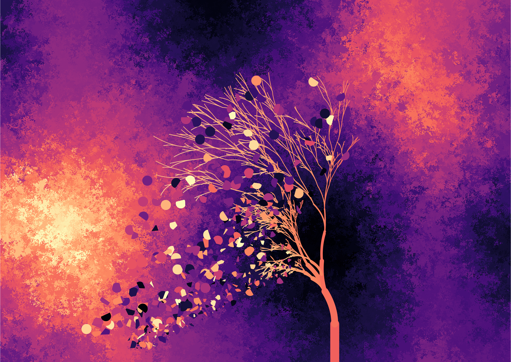
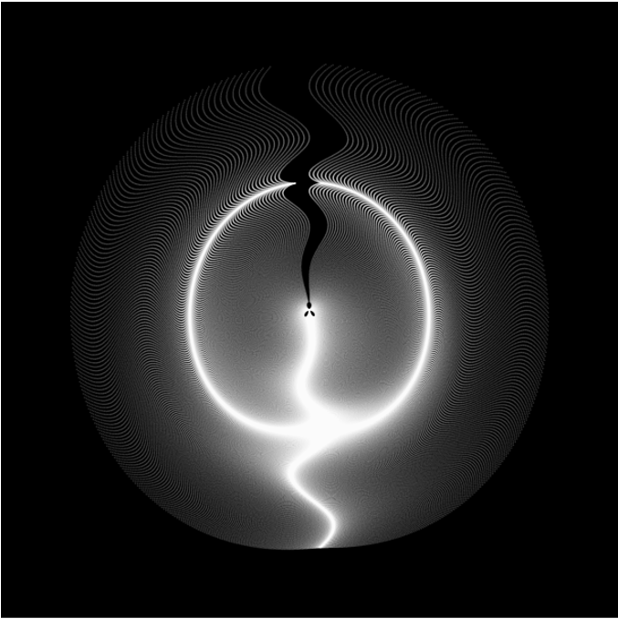
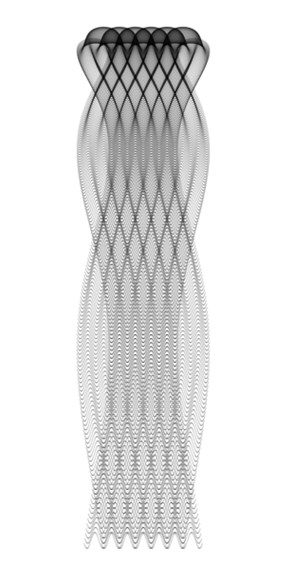
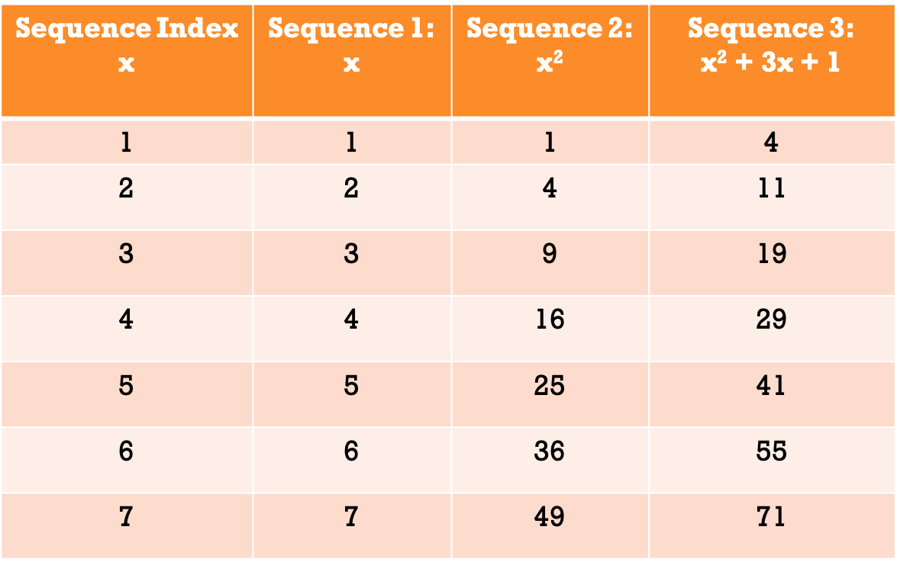
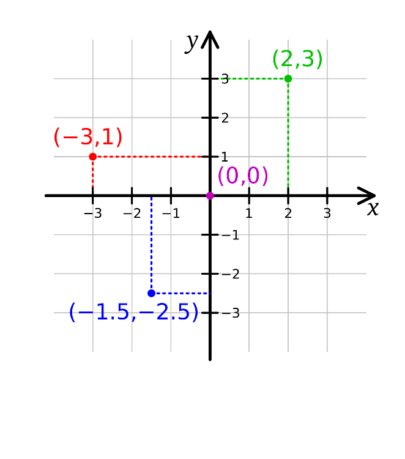
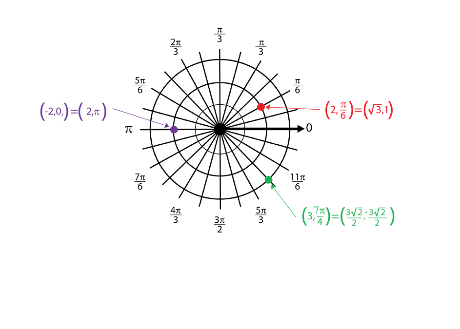

```{r setup, include=FALSE}
knitr::opts_chunk$set(echo = FALSE)
library(tidyverse)
```

## Session Objectives and Transferable Skills

<div style="float: left; width: 50%;">
- To be introduced to the R Universe, in particular the tidyverse and ggplot2
- To be able to code something artistic in R
- To begin to think more creatively regarding code and data analysis 
- To consider the beauty of code, mathematics and patterns
</div>
<div style="float: right; width: 50%;">
- Basic introduction to the use of R and the tidyverse
- Basic visualisation techniques using ggplot2
- Creative problem solving and debugging 
</div>

## Schedule 

- Introduction (15 minutes)
- Part 1: (30 minutes)
    - Introduction to basic mathematical coding and patterns 
    - Introduction to layered coding using the Tidyverse and ggplot2
- Break (5 minutes)
- Part 2: (30 minutes)
    - Integration of mathematical patterns into ggplot graphics
    - Experimentation and Exploration 
- Review and Conclusion (10 minutes)

## Why creativity 

- Creativity is important for approaching novel and complex problems.
- It can be applied both in the design and application of *black-box* procedures to problems.

- Like many programming languages, there are multiple ways in R to achieve any singular goal. 

## Examples {.smaller}

From Danielle Navarro (@djnavarro)

<div style="float: left; width: 45%;">

```{r, out.width = "400px", out.height= "400px", echo=FALSE}
knitr::include_graphics("images/windswept_05_152.jpg")
```

</div>
<div style="float: right; width: 45%;">

```{r, out.width = "400px", out.height= "400px", echo=FALSE}

```

</div>

## Examples {.smaller}

From the Fronkonstin Blog

<div style="float: left; width: 45%;">

```{r, out.width = "400px", out.height= "400px", echo=FALSE}

```

</div>
<div style="float: right; width: 45%;">

```{r, out.width = "200px", out.height= "400px", echo=FALSE}

```

</div>

## Generated Mathematical Sequences

```{r, echo=FALSE, fig.align='center'}

```

## Coordinate Systems

<div style="float: left; width: 45%;">

```{r, out.width = "400px", out.height= "400px", echo=FALSE}

```

</div>
<div style="float: right; width: 45%;">

```{r, out.width = "400px", out.height= "400px", echo=FALSE}

```

</div>


# Introduction to R, the Tidyverse & ggplot2

# Part 1

## Grammer of Graphics Example {.smaller}

<font size = "1">
```{r, echo = TRUE, out.height="300px", out.width="500px"}
ggplot(data = diamonds, 
       mapping = aes(x = price, 
                     y = carat, 
                     colour = cut)) + 
  geom_point() + 
  labs(title = "Diamond Price, plotted against Carat", 
       x = "Price",
       y = "Carat")

```
</font>

## Grammer of Graphics Example 2 {.smaller}

<font size = "1">
```{r, echo = TRUE, out.height="300px", out.width="500px"}
ggplot() + 
  geom_point(data = diamonds, 
       mapping = aes(x = price, 
                     y = carat, 
                     colour = cut)) + 
  labs(title = "Diamond Price, plotted against Carat", 
       x = "Price",
       y = "Carat")

```
</font>

## ggplot example 

```{r, echo=FALSE, fig.align='center'}
knitr::include_graphics("images/ggplot_dia_1.png")
```

## ggplot example 

```{r, echo=FALSE, fig.align='center'}
knitr::include_graphics("images/ggplot_dia_2.png")
```

## Layered Coding {.smaller}

<div style="float: left; width: 45%;">

- geom functions 
  - geom_line() - line chart
  - geom_point() - scatter plot
  - geom_ploygon() - shape diagram
- Aesthetic Descriptors 
  - Fill = - inside/fill colour
  - Colour = - Border colour
  - Alpha = - Transparency Level (0 -> 1)
  - Linetype = - Line Type / Border Type
  - Size = - Border thickness / Point Size
  - Shape = - Point Shape

</div>
<div style="float: right; width: 45%;">

- Themes
  - theme() - base theme
  - theme_bw() - black and white theme
  - theme_void() - empty theme (no scales, legends etc)
- Scales 
  - labs(), xlab(), ylab(), ggtitle() - Labels
  - lims(), xlim(), ylim() - Scale Limits
- Coordinate Systems 
  - coord_cartesian() - Cartesian Coordinate System
  - coord_polar() - Polar Coordinate System

</div>

## Understanding Polar Coordinates

- Coordinates on the x-axis indicate the circular movement.
- Coordinates on the y-axis indicate the distance of the points from the origin.
- The origin of the plot is defined as the centre of the plot
- The plot begins and ends at the top of the plot (before rotating right)

## Incorporating Colours

- Base R:
  - Blue: "blue"
  - Red: "red"

- Hex/RGB Code:
  - Blue: #0074D9
  - Red: #FF4136

- Palettes from R Packages
  - RColorBrewer
  - ghibli (colours inspired by Studio Ghibli Films)
  - palettetown (colour inspired by pokemon)
  
## Putting together the basics {.smaller}

**Exercise 1:** 

- Using the data provided (ex1.dat), plot the data onto a scatterplot using ggplot(). 
- This will map the numerical values of sin(x), where x is the number 0 to 100 (at an interval of 0.1), onto its index (1:1001) as a scatterplot.
- For those using the beginners worksheet, a template has been provided. 

**Bonus:**

- Using geom_line() or another geom function within ggplot(),  plot this same data in another way.

```{r eval = FALSE, echo = TRUE}
ex1.dat <- as.data.frame(
	seq(from = 0,
		to = 100,
		by = 0.1))
ex1.dat <- sin(ex1.dat)
colnames(ex1.dat) = “sine”
```

## Putting together the basics: Solution {.smaller}

```{r, out.height="300px", out.width="500px", echo = TRUE}
ex1.dat <- as.data.frame(seq(from = 0,
		to = 100,
		by = 0.1))
ex1.dat <- sin(ex1.dat)
colnames(ex1.dat) <- "sine"

ggplot(data = ex1.dat,
	mapping = aes(x = 1:1001, 
				     y = sine)) + 
	geom_point() 

```

## Tidying up the graphics {.smaller}

```{r, eval = FALSE}
theme(
	panel.grid.major = element_blank(), 	panel.grid.minor = element_blank(),
        panel.background = element_blank(), 	axis.line = element_blank(), 
        axis.title = element_blank(), 
	axis.text = element_blank(),
        axis.ticks = element_blank()) 

# Or 

theme_void()

```

# Questions? 

# Break (5 minutes)

## Advanced Artistic ggplot patterns 

Exercise 6: Lets get creative!

- Ideas:
  - Try different geom_() functions (point, polygon, line)
  - Try different colours, palettes or layers
  - Try different plotting types, polar vs standard
  - Try multiple different layers and effects together
  - Try changing aesthetic features, alpha, colour, fill etc…

## Any questions or feedback? 

Contact me directly: 

- thomasjwise.com
- thomas.j.wise@outlook.com
- Twitter: @tpsychwise
- Linkedin: linkedin.com/in/tjwise213


